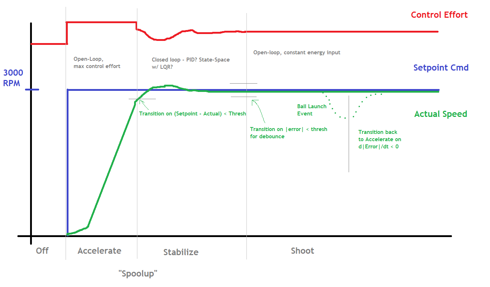

# Control Algorithm - Long Shot Precise Mode

There are four main states the shooter progresses through:

## Off

Shooter is not running. Set voltage to 0 in coast mode.

## Accelerate

Shooter speed is well below the setpoint. Accelerate as fast as possible by setting the output to full Vbatt in an open-loop control mode.

## Stabilize

Shooter speed is almost at (or slightly above) setpoint. Use a closed-loop PID controller (with heavy I gain) to dial in the shooter to the setpoint speed.

## Shoot

After the speed has been stable at the setpoint for a few loops, the control algorithm locks in the voltage output and switches to open-loop mode. At this point the conveyor may begin feeding power cells. The shooter remains in this state until the speed drops below a threshold, and dSpeed/dT shows a zero-crossing (shooter speed has begun to "recover"). This is assumed to represent that the ball has left the shooter wheel fully, and we should switch back to Accelerate to recover speed as quickly as possible.

The reason for shooting open-loop was multi-fold:

1) It's how we prototyped
2) It's what 254 did in 2017
3) It seemed to work.

# Control Algorithm - Short Shot Rapid Mode

The states are the same as above, with one exception:

## Fast Shoot

In this mode, once the first ball is detcted in the shooter (due to dip in shooter RPM), the shooter stays open loop but goes to a higher, constant setpoint (near full Vbatt). The conveyor is allowed to feed continuously during this mode.

It's not as accurate - shot location drifts up over time. But it does eject balls faster, and is sufficent when the shot is taken close up.
